<div align="center">

# 🧬 NaturalDB

### Talk to Any Database in Plain English

[](https://python.org)
[](https://streamlit.io)
[](https://crewai.com)
[](https://ai.google.dev)

<br/>

**NaturalDB** is an AI-powered database assistant that lets you interact with relational databases using natural language. Ask questions, run analyses, perform CRUD operations, and generate ER diagrams — all without writing a single line of SQL.

<br/>


</div>

---

## ✨ Features

| Feature | Description |
|---------|-------------|
| 💬 **Natural Language Queries** | Ask questions in plain English and get instant SQL results |
| 📊 **Data Analysis** | Uncover trends, patterns, and insights from your data |
| 🛠️ **CRUD Operations** | Create, read, update, and delete records conversationally |
| 🧩 **ER Diagram Generation** | Auto-generate entity-relationship diagrams in Mermaid.js |
| 🔒 **Secure Execution** | Role-based agent permissions prevent destructive operations |
| 🗄️ **Multi-Database Support** | Works with MySQL, PostgreSQL, and SQLite |

---

## 🧠 Architecture

NaturalDB uses a **multi-agent system** powered by [CrewAI](https://crewai.com) where specialized AI agents collaborate to handle your requests:

```mermaid
graph TD
    subgraph User
        UQ["🗣️ Natural Language Query"]
    end

    subgraph Orchestrator
        ORC["🧠 Chief Database Orchestrator"]
    end

    subgraph Specialists
        SA["📋 Schema Analyst"]
        DM["🛠️ Database Manager"]
        DA["📊 Data Analyst"]
        ERD["🧩 ERD Specialist"]
    end

    subgraph Tools
        SQL["⚡ SQL Executor"]
    end

    subgraph Output
        FMT["✍️ Response Formatter"]
        RESP["📤 Formatted Answer"]
    end

    UQ --> ORC
    ORC --> SA
    ORC --> DM
    ORC --> DA
    ORC --> ERD

    SA --> SQL
    DM --> SQL
    DA --> SQL

    SQL --> FMT
    ERD --> FMT
    FMT --> RESP
```



| Agent | Role |
|-------|------|
| **Orchestrator** | Analyzes intent, delegates tasks, compiles results |
| **Schema Analyst** | Extracts and documents database structure |
| **Database Manager** | Executes secure CRUD operations |
| **Data Analyst** | Performs deep analytical queries and insight extraction |
| **ERD Specialist** | Generates entity-relationship diagrams |
| **Response Formatter** | Polishes output for clarity and readability |

---

## 🖼️ Screenshots

<details>
<summary><b>📄 CRUD Operations</b> (IMDb Database)</summary>
<br/>

</details>

<details>
<summary><b>📊 Data Analysis</b> (KnightLab Mystery Database)</summary>
<br/>

</details>

<details>
<summary><b>🧩 ER Diagram Generation</b> (IMDb Database)</summary>
<br/>

</details>

---

## 🚀 Quick Start

### 1. Clone the Repository

```bash
git clone https://github.com/joshi-mitali/NaturalDB.git
cd NaturalDB
```

### 2. Install Dependencies

```bash
pip install -r requirements.txt
```

### 3. Configure Environment

Copy the example environment file and add your API key:

```bash
cp .env.example .env
```

Then edit `.env` with your [Gemini API key](https://aistudio.google.com/):

```env
GEMINI_MODEL=gemini-2.0-flash
GEMINI_MODEL_REASONING=gemini-2.5-flash-preview-04-17
GEMINI_API_KEY=your_api_key_here
```

### 4. Run the App

```bash
streamlit run app.py
```

---

## 🧰 Tech Stack

| Layer | Technology |
|-------|-----------|
| **Frontend** | Streamlit (custom dark theme) |
| **AI Framework** | CrewAI (multi-agent orchestration) |
| **LLM** | Google Gemini 2.0 Flash / 2.5 Flash |
| **Database** | SQLAlchemy (MySQL, PostgreSQL, SQLite) |
| **Diagrams** | Mermaid.js (rendered via mermaid.ink) |
| **Language** | Python 3.10+ |

---

## 📁 Project Structure

```
NaturalDB/
├── app.py                      # Streamlit application entry point
├── requirements.txt            # Python dependencies
├── .env.example                # Environment variable template
├── assets/                     # Screenshots and images
│   ├── analysis.png
│   ├── crud.png
│   ├── erd.png
│   └── asksql-connect.png
└── src/
    ├── crew.py                 # CrewAI agent and task definitions
    ├── config/
    │   ├── agents.yaml         # Agent role configurations
    │   └── tasks.yaml          # Task definitions
    └── tools/
        └── SQLExecutorTool.py  # SQL execution tool for agents
```

---

## 🤝 Contributing

Contributions are welcome! Feel free to:

1. **Fork** this repository
2. **Create** a feature branch (`git checkout -b feature/amazing-feature`)
3. **Commit** your changes (`git commit -m 'Add amazing feature'`)
4. **Push** to the branch (`git push origin feature/amazing-feature`)
5. **Open** a Pull Request

---

## 📄 License

This project is open source and available under the [MIT License](LICENSE).

---

<div align="center">

**Built with ❤️ using CrewAI, Streamlit, and Google Gemini**

</div>
